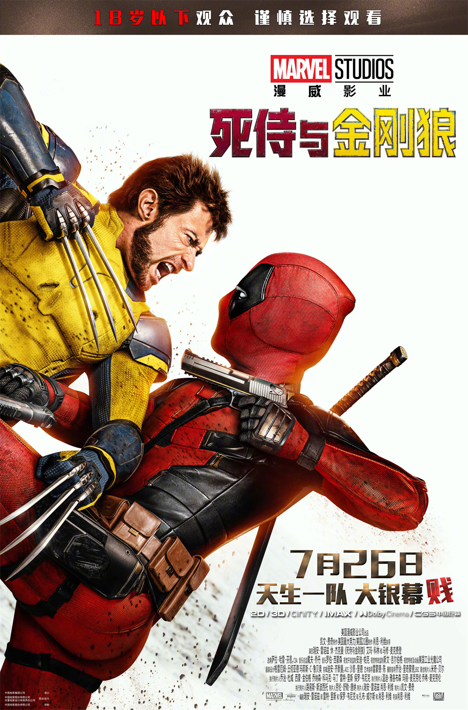

刚从前两天反复观看君名的心情中平复下来，在一众自己关注的超英影评UP主的怂恿下去看了号称是漫威救世主的死侍与金刚狼。为了迎接这部期待能拯救颓势中的漫威宇宙的电影特地在上海为数不多的激光IMAX厅买了皇帝位。结果大失所望。

前两部死侍的电影都是自己在电脑上看的，对当时的我来说完全是耳目一新的超英角色，这种打破第四面墙，完全把过往超英作品坚持的东西踩在脚下，但是又会给人感动的角色真的非常吸引当时我的眼球。所以在这部死侍与金刚狼上映的时候，其实我也是抱着看一部死侍作品去的（或许这也是为什么我感觉这部作品没有那么好看）

金刚狼与死侍双主角的设定，从根本上就决定了这部电影不可能会像之前的两部作品一样发挥出死侍独特的角色魅力。只能说这是一种两难的处境。狼叔在大荧幕上的回归绝对会吸引到非常多的粉丝，鉴于很多漫威的粉丝同时也看过了X战警的大部分作品，这样的合作对大部分同时喜欢两部作品的粉丝来说绝对是加分项，但是如果仅仅是喜欢死侍独特的魅力，那我只能说这部电影狼叔的加入对我而言有一点冲淡了这种感觉。

粉丝尚且如此，路人更不必说了，想要看懂这部作品，需要的前置作品数不胜数，尤其是在the void的打戏，如果你对美漫超英有过研究，那么这一场戏绝对是会让人哭出来的粉丝见面会。但是如果你是纯纯的路人或者纯漫威电影粉，在the void中的故事对你而言就仅仅是一堆你没见过的新角色在一个奇怪的地方眼花缭乱的打来打去。更不要提the void本身就是Loki里面提到的概念，如果你看过Loki或许可以联想到当时Classical Loki高喊 “Glorious Purpose!”重建阿斯加德的场景，但是如果你没看过，不好意思

> 诶，他们是谁？这是哪？这给我干哪来了？？？

更别提这部作品本身的故事逻辑极其简单幼稚，如果这是一部以死侍为单一主角的作品，或许他自己可以用他独特的人格魅力和打破第四面墙的能力来将这个故事变得很有趣，但是如果你决定拉着金刚狼一起（尤其是罗根本身就是那种很严肃的角色），不好意思，作为观众的我只会感觉这个故事写的很无厘头并且很经不起推敲。

In conclusion，如果你是一位看过几乎所有漫威作品，X战警系列，甚至漫画都看过不少的观众，这部电影绝对是王炸般的享受。

如果你只是路人观众，不好意思，看完第一幕bye bye bye就可以bye bye了。
